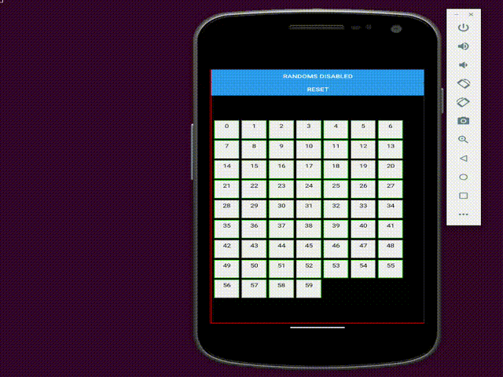

# react-native-events-hooks

The library provides a flexible and powerful mechanism for event management within React Native applications. It allows components to subscribe to specific events and react to them, facilitating communication between dispersed components throughout the application without the need for prop drilling or complex contexts. It offers functionalities for handling both global events, shared across the entire application, and private events, limited to the scope of an individual component, thus offering great versatility in managing communication between components.

Powered by [César Casas](https://www.linkedin.com/in/cesarcasas/)


- [react-native-events-hooks](#react-native-events-hooks)
- [install](#install)
- [Global and Private Event Handling](#global-and-private-event-handling)
	- [Manejo de Eventos Globales y Privados](#manejo-de-eventos-globales-y-privados)
	- [Subscription Management](#subscription-management)
	- [Automatic Cleanup](#automatic-cleanup)
	- [Implementation Flexibility](#implementation-flexibility)
	- [Unique Listener IDs](#unique-listener-ids)
- [useEvents](#useevents)
	- [listen and listenPrivate](#listen-and-listenprivate)
	- [emit and emitPrivate](#emit-and-emitprivate)
	- [unlisten and unlistenPrivate](#unlisten-and-unlistenprivate)
	- [removeAllListenersByEvent](#removealllistenersbyevent)
- [getAllEventsName](#getalleventsname)
- [Implementation Highlights](#implementation-highlights)
- [Recommended Use](#recommended-use)
- [Ejemplo](#ejemplo)
- [Changelog](#changelog)
- [MIT License](#mit-license)


# install
```bash
$ npm install react-native-events-hooks --save
```

# Global and Private Event Handling

## Manejo de Eventos Globales y Privados
Enables components to listen to and emit both global events, which are accessible throughout the entire application, and private events, confined to the emitting and listening components, providing precise and efficient event management.

## Subscription Management
Offers a straightforward API for components to subscribe to events, enabling them to react dynamically to changes or actions across the application.

## Automatic Cleanup
Incorporates automatic listener cleanup mechanisms to prevent memory leaks, especially for private events, ensuring components only listen to relevant events during their lifecycle.

## Implementation Flexibility
The library's design ensures easy integration into existing projects, allowing developers to implement sophisticated event-driven behaviors with minimal code changes.

## Unique Listener IDs
Generates unique IDs for event listeners, simplifying the subscription and unsubscription process and enhancing the manageability of event listeners.

# useEvents

`useEvents` is a hook that provides a list of methods to operate with our events.

```javascript
function MyBox({ boxId }) {
	const {
		listen,
		unlisten,
		emit,
	} = useEvents();
	...
```

## listen and listenPrivate
To subscribe to either global or private events, respectively. Callbacks registered through these methods will be invoked when the corresponding event is emitted. Both methods return a listenerId. It's important to understand that when performing `listen` or `listenPrivate`, it should be done within a useEffect to prevent multiple subscriptions to the same event.

```javascript
useEffect(() => {
	const listenerId = listen('backgroundChage', (payload) => {
		if (payload.boxId === boxId) {
			setBackgroundColor(payload.backgroundColor);
		}
	});

	const listener2Id = listen('resetBoxState', () => setBackgroundColor('#efefef'));

	return () => {
		unlisten('backgroundChage', listenerId);
		unlisten('resetBoxState', listener2Id);
	};
}, []);

```

## emit and emitPrivate
```javascript
export default function App() {
	const {
		emit,
	} = useEvents();

	return (
		<Button
			style={styles.btn}
			title="Reset"
			onPress={() => emit('resetBoxState')}
		/>
	);
}
```

## unlisten and unlistenPrivate
These methods remove listeners from an event. Both the `eventName` and `listenerId` are required.

```javascript
useEffect(() => {
	const listenerId = listen('backgroundChage', (payload) => {
		if (payload.boxId === boxId) {
			setBackgroundColor(payload.backgroundColor);
		}
	});

	const listener2Id = listen('resetBoxState', () => setBackgroundColor('#efefef'));

	return () => {
		unlisten('backgroundChage', listenerId);
		unlisten('resetBoxState', listener2Id);
	};
}, []);
```

## removeAllListenersByEvent
Removes all listeners for a given `eventName`.

# getAllEventsName
This method allows us to retrieve all the events registered up to the moment.

```javascript
import { getAllEventsName } from 'react-native-events-hook';
```


# Implementation Highlights

- `Global and Private Events:` The distinction between global and private events allows components to handle events specifically within their own scope or share events across the application as needed.

- `State Management for Private Events:` Using `useState` to store private events enables components to have their own set of listeners that do not impact or get affected by other components unless the information is explicitly shared.

# Recommended Use
This library is ideal for `React applications` that require complex management of communication between components, especially in cases where `prop drilling` or excessive use of `contexts` becomes impractical. It is particularly useful in large and modular applications, where the separation of concerns and efficiency in communication between components are critical for maintenance and scalability.


# Ejemplo
The provided example illustrates how to use `useEvents` to create an interactive dynamic where multiple "boxes" can change color randomly or reset to an initial state. This demonstrates the power of `react-native-events-hooks` to facilitate complex interactions between components efficiently and with reduced code.




```javascript
import {
	useState,
	useEffect,
} from 'react';

import {
	View,
	StyleSheet,
	Text,
	Button,
} from 'react-native';

import {
	useEvents,
} from 'react-native-events-hooks';

const styles = StyleSheet.create({
	container: {
		borderWidth: 1,
		borderColor: '#FF0000',
		flex: 1,
		marginTop: 40,
	},
	btn: {
		marginTop: 10,
		backgroundColor: '#333333',
	},
	boxes: {
		flex: 1,
		flexDirection: 'row',
		alignItems: 'center',
		alignContent: 'center',
		flexWrap: 'wrap',
		padding: 4,
	},
	box: {
		marginVertical: 2,
		marginHorizontal: 2,
		borderWidth: 1,
		borderColor: 'green',
		width: 50,
		height: 50,
		alignItems: 'center',
		padding: 4,
	},
});

function MyBox({ boxId }) {
	const {
		listen,
		unlisten,
	} = useEvents();
	const [backgroundColor, setBackgroundColor] = useState('#efefef');

	useEffect(() => {
		const listenerId = listen('backgroundChage', (payload) => {
			if (payload.boxId === boxId) {
				setBackgroundColor(payload.backgroundColor);
			}
		});

		const listener2Id = listen('resetBoxState', () => setBackgroundColor('#efefef'));

		return () => {
			unlisten('backgroundChage', listenerId);
			unlisten('resetBoxState', listener2Id);
		};
	}, []);

	console.info('rendering box: ', boxId);
	return (
		<View
			style={[styles.box, { backgroundColor }]}
		>
			<Text>{`${boxId}`}</Text>
		</View>
	);
}

export default function App() {
	const [totalBoxes] = useState(60);
	const [runRandomColors, setBackgroundColors] = useState(false);

	const {
		emit,
	} = useEvents();

	useEffect(() => {
		const intervalId = setInterval(() => {
			if (!runRandomColors) return;
			emit('backgroundChage', {
				backgroundColor: `#${Math.round(Math.random() * 16777215).toString(16).toUpperCase()}`,
				boxId: Math.round(Math.random() * (totalBoxes - 1)),
			});
		}, 300);

		return () => clearInterval(intervalId);
	}, [runRandomColors]);

	return (
		<View style={styles.container}>
			<Button
				style={styles.btn}
				title={`${runRandomColors ? 'Randoms enabled' : 'Randoms disabled'}`}
				onPress={() => setBackgroundColors((prev) => !prev)}
			/>
			<Button
				style={styles.btn}
				title="Reset"
				onPress={() => emit('resetBoxState')}
			/>
			<View style={styles.boxes}>
				{[...Array(totalBoxes)].map((a, index) => (
					<MyBox
						key={`box-${index}`}
						boxId={index}
					/>
				))}
			</View>
		</View>
	);
}

```
# Changelog
- Mar 25, 2024. Version 1.0.2
  - Added English documentation.


# MIT License
